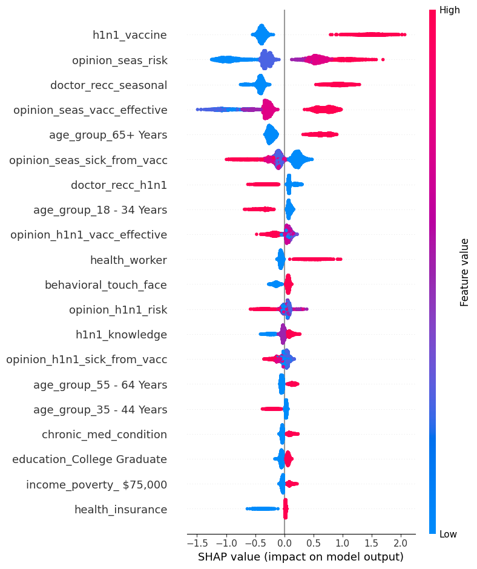

# Predicting Seasonal Flu Vaccine Uptake

## Overview
This project aims to predict seasonal flu vaccine uptake based on a person's background and behavioral patterns. The analysis leverages various machine learning models to identify key factors contributing to vaccine hesitancy.

## Business and Data Understanding
In 2019, a novel Coronavirus (COVID-19) caused severe respiratory problems globally. Vaccine hesitancy, which is the reluctance to receive vaccines due to fears and misinformation, poses significant threats to global health. This project uses historical data to understand and predict vaccine hesitancy, aiming to mitigate its impact in future pandemics.

## Modeling
We employed several machine learning models, including Logistic Regression, Random Forest, Gradient Boosting, and XGBoost, to predict vaccine uptake. The models were evaluated based on their accuracy, precision, recall, and ROC AUC scores.

## Evaluation
The XGBoost model achieved the best performance with the following metrics:
- Accuracy: 81.25%
- ROC AUC Score: 0.8850

### ROC AUC Scores of Different Models:
- Logistic Regression: 0.8775
- Random Forest: 0.8782
- Gradient Boosting: 0.8847
- XGBoost: 0.8850

### Correlation Analysis

### Comparison of ROC AUC Scores of Different Models:

### SHAP Summary Plot

## Recommendations
Based on our analysis, we recommend:
1. **Targeted Public Health Campaigns:** Develop campaigns for specific demographics less likely to take the flu vaccine.
2. **Doctor Recommendations:** Encourage healthcare providers to discuss vaccine importance during visits.
3. **Community Engagement:** Work with community leaders to spread accurate vaccine information.
4. **Education and Awareness:** Implement educational programs to dispel myths about vaccines.
5. **Access to Vaccination Services:** Improve access, especially for underserved populations.
6. **Policy Support:** Advocate for policies supporting vaccination efforts.
7. **Continuous Monitoring:** Continuously monitor vaccination rates and adjust strategies accordingly.

## Next Steps
1. Implement the recommended public health campaigns.
2. Monitor the effectiveness of these interventions.
3. Continuously update the predictive model with new data.

## Thank You
Thank you for reviewing this project. For any questions or further information, please contact [Magdalene Ondimu. magdalene.ondimu@student.moringaschool.com].

## Repository Structure

